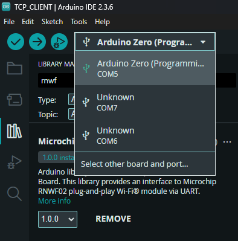

# Microchip RNWF02 Arduino Library

> "IoT Made Easy!" 

Devices: **| RNWF02 | ARDUINO ZERO | SAMD21 | ARDUINO GRAND CENTRAL | SAMD51 |** 
Features: **| Wi-Fi |**

## ⚠ Disclaimer

<b>
THE SOFTWARE ARE PROVIDED "AS IS" AND GIVE A PATH FOR SELF-SUPPORT AND SELF-MAINTENANCE. This repository contains example code intended to help accelerate client product development.  

For additional Microchip repos, see: <a href="https://github.com/Microchip-MPLAB-Harmony" target="_blank">https://github.com/Microchip-MPLAB-Harmony</a>

Checkout the <a href="https://microchipsupport.force.com/s/" target="_blank">Technical support portal</a> to access our knowledge base, community forums or submit support ticket requests.

</b>

## Contents

1. [Introduction](#step1)
1. [Bill of materials](#step2)
1. [Software Setup](#step3)
1. [Hardware Setup](#step4)
1. [Board Programming](#step5)

## 1. Introduction<a name="step1">

This is an Arduino library that enables the use of the Microchip RNWF02 plug-and-play Wi-Fi module with the Arduino Zero, Grand Central, and other compatible Arduino boards. It uses [AT commands](https://ww1.microchip.com/downloads/aemDocuments/documents/WSG/ProductDocuments/SupportingCollateral/AT-Command-Specification-v2.0.0.pdf) to configure and communicate with the module. The library includes two example projects, as listed below.

## TCP CLIENT & SERVER

### Example 1: TCP CLIENT

The application uses AT commands to configure the RNWF02 module as a TCP client, enabling it to initiate connections to a TCP server and perform data exchange.

### Example 2: TCP SERVER

The application also supports configuring the RNWF02 module as a TCP server using AT commands, allowing it to listen for incoming TCP client connections and handle data exchange.

## 2. Bill of materials<a name="step2">

| TOOLS | QUANTITY |
| :- | :- |
| [RNWF02 Add On Board](https://www.microchip.com/en-us/development-tool/ev72e72a) | 1 |
| [UNO click shield](https://www.mikroe.com/arduino-uno-click-shield) | 1 |
| [Arduino Zero](https://store-usa.arduino.cc/products/arduino-zero) / [Arduino Grand Central](https://www.digikey.in/short/577w2n45) | 1 |

## 3. Software Setup<a name="step3">

- [Arduino IDE 2.3.6](https://www.arduino.cc/en/software)

- [TCP UDP Server & Client App](https://play.google.com/store/apps/details?id=tcpudpserverclient.steffenrvs.tcpudpserverclient)

## 4. Hardware Setup<a name="step4">

- Connect the RNWF02 Add-on Board to the Mikro BUS 1 of the Arduino UNO click SHIELD as shown below.

## 5. Board Programming<a name="step5">

- Search for Microchip_RNWF02 in the library and install it.

- Open TCP_CLIENT or TCP_SERVER example sketch from File->Examples->Microchip_RNWF02 for programming the board.

- Select the programming port of the Arduino Board and upload the sketch.

## License

	© 2025 Microchip Technology Inc. and its subsidiaries. All rights reserved.

	Subject to your compliance with these terms, you may use this Microchip software and any derivatives 
	exclusively with Microchip products. You are responsible for complying with third party license terms 
	applicable to your use of third party software (including open source software) that may accompany this 
	Microchip software. SOFTWARE IS “AS IS.” NO WARRANTIES, WHETHER EXPRESS, IMPLIED OR 
	STATUTORY, APPLY TO THIS SOFTWARE, INCLUDING ANY IMPLIED WARRANTIES OF NON-INFRINGEMENT,
	MERCHANTABILITY, OR FITNESS FOR A PARTICULAR PURPOSE. IN NO EVENT WILL 
	MICROCHIP BE LIABLE FOR ANY INDIRECT, SPECIAL, PUNITIVE, INCIDENTAL OR CONSEQUENTIAL LOSS, 
	DAMAGE, COST OR EXPENSE OF ANY KIND WHATSOEVER RELATED TO THE SOFTWARE, HOWEVER 
	CAUSED, EVEN IF MICROCHIP HAS BEEN ADVISED OF THE POSSIBILITY OR THE DAMAGES ARE 
	FORESEEABLE. TO THE FULLEST EXTENT ALLOWED BY LAW, MICROCHIP’S TOTAL LIABILITY ON ALL 
	CLAIMS RELATED TO THE SOFTWARE WILL NOT EXCEED AMOUNT OF FEES, IF ANY, YOU PAID DIRECTLY 
	TO MICROCHIP FOR THIS SOFTWARE

